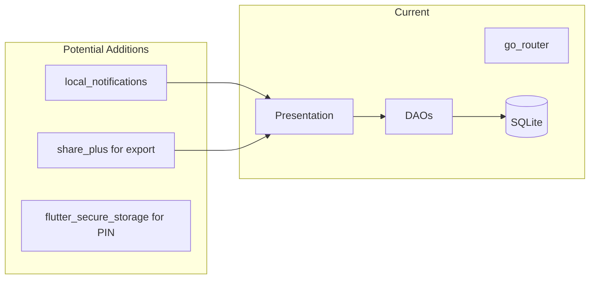
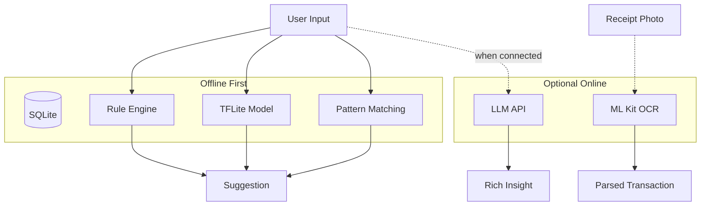

# MasterOfCoin - Feature Ideas

Based on analysis of the codebase, the app currently has: **transactions** (income/expense), **income sources**, **expense categories**, **savings goals** (with withdrawals/usage tracking), **budgets** (monthly per category), **recurring templates** (manual "Add now"), **analytics** (charts, spending by category), **dashboard**, **settings** (currency, exchange rate, theme), and **onboarding**. All data is **offline-first** via SQLite.

---

## Data & Reporting

| Feature                         | Description                                                                  | Effort |
| ------------------------------- | ---------------------------------------------------------------------------- | ------ |
| **Export to CSV/PDF**           | Export transactions, savings, or reports by date range for tax/records       | Medium |
| **Data backup & restore**       | Backup SQLite to file, restore from backup (critical for offline-first)      | Medium |
| **Yearly/quarterly reports**    | Summaries beyond the current 6-month analytics view                          | Low    |
| **Unified balance (converted)** | Show total wealth in one currency using the exchange rate for quick overview | Low    |

---

## Recurring & Automation

| Feature                            | Description                                                                               | Effort |
| ---------------------------------- | ----------------------------------------------------------------------------------------- | ------ |
| **Auto-apply recurring templates** | Background job or reminder to apply weekly/monthly templates (currently manual "Add now") | Medium |
| **Reminders for recurring**        | Local notifications: "Apply salary template?" on payday                                   | Medium |
| **Savings reminders**              | "You haven't topped up [goal] this month"                                                 | Low    |

---

## Transactions & UX

| Feature                       | Description                                                                                             | Effort |
| ----------------------------- | ------------------------------------------------------------------------------------------------------- | ------ |
| **Transfers**                 | `TransactionType.transfer` exists in schema—implement UI to move money between currencies or to savings | Medium |
| **Transaction search/filter** | Search by note, category, date range, amount                                                            | Low    |
| **Duplicate transaction**     | Quick "Duplicate" action when adding similar entries                                                    | Low    |
| **Swipe actions**             | Swipe to edit/delete on transaction list (beyond current dismiss-to-delete)                             | Low    |

---

## Savings Enhancements

| Feature                    | Description                                                             | Effort |
| -------------------------- | ----------------------------------------------------------------------- | ------ |
| **Savings goal icons**     | Let users pick an icon per goal (currently `iconName` exists in schema) | Low    |
| **Projected completion**   | "At current rate, you'll reach goal by [date]"                          | Medium |
| **Multiple contributions** | History view of all top-ups per goal                                    | Low    |

---

## Zimbabwe-Specific

| Feature                           | Description                                                           | Effort |
| --------------------------------- | --------------------------------------------------------------------- | ------ |
| **Live exchange rate (optional)** | Fetch ZWG rate from an API when online; fall back to manual setting   | Medium |
| **Exchange rate history**         | Store historical rates in `exchange_rates` table for past conversions | Medium |
| **Localization (Shona/Ndebele)**  | Add ARB strings and translations for Zimbabwe languages               | Medium |

---

## Notifications & Engagement

| Feature                            | Description                                       | Effort |
| ---------------------------------- | ------------------------------------------------- | ------ |
| **Budget alerts**                  | "You've used 80% of Groceries budget"             | Low    |
| **Savings milestone celebrations** | Simple confetti or message when goal is reached   | Low    |
| **Daily/weekly digest**            | Optional notification summarizing spend vs budget | Medium |

---

## Quality of Life

| Feature                                  | Description                                                  | Effort |
| ---------------------------------------- | ------------------------------------------------------------ | ------ |
| **Date range picker**                    | Filter transactions and reports by custom date range         | Low    |
| **Quick add**                            | Home-screen shortcut for last-used transaction type/category | Low    |
| **Pin/biometric lock**                   | Protect app with PIN or fingerprint                          | Medium |
| **Currency filter on transactions list** | Filter transactions by USD/ZWG (like income sources)         | Low    |
| **Haptic feedback**                      | Light haptics on key actions (add, delete, toggle)           | Low    |

---

## Architecture Considerations

- **Backup**: Use `path_provider` (already in deps) + `share_plus` for export.
- **Notifications**: Add `flutter_local_notifications` for reminders.
- **PIN lock**: Use `flutter_secure_storage` for storing hash; lock screen as overlay.

---

## Differentiators (Features That Set MasterOfCoin Apart)

| Feature                        | Why It Differentiates                                                                                              | Effort |
| ------------------------------ | ------------------------------------------------------------------------------------------------------------------ | ------ |
| **Dual-currency intelligence** | Smart suggestions: "Convert ZWG to USD now?" when rate is favorable; "Your USD balance is low—consider topping up" | High   |
| **Informal economy support**   | Categories for cash jobs, market sales, diaspora remittances; optional "unrecorded income" for privacy             | Medium |
| **Remittance tracker**         | Dedicated flow for money sent/received from abroad—who, when, amount, purpose. Unique for Zimbabwe diaspora        | Medium |
| **ZiG volatility dashboard**   | Track exchange rate over time; "Your ZWG lost X% vs USD this month" for awareness                                  | Medium |
| **WhatsApp-style quick entry** | Voice memo or shorthand: "50 usd groceries" → auto-parsed transaction (powered by AI)                              | High   |
| **Cash vs digital split**      | Tag transactions as cash, EcoCash, bank transfer, etc.—see where money actually lives                              | Medium |
| **Privacy-first ethos**        | No cloud sync by default; optional encrypted backup; "Your data never leaves your device" as a selling point       | Low    |
| **Zimbabwe tax readiness**     | Export format compatible with ZIMRA; annual summary for local tax filing                                           | Medium |
| **Local payment method logos** | EcoCash, OneMoney, InnBucks, etc. as quick-add buttons or transaction tags                                         | Low    |

---

## AI Features

### Offline / On-Device AI

| Feature                        | Description                                                                             | Tech                                 | Effort |
| ------------------------------ | --------------------------------------------------------------------------------------- | ------------------------------------ | ------ |
| **Smart categorization**       | Auto-suggest category for new transactions from note text (e.g. "Shoprite" → Groceries) | TensorFlow Lite, rule-based patterns | Medium |
| **Spending pattern detection** | "You usually spend ~$X on transport; this month you're at $Y"                           | Local aggregation + simple ML        | Low    |
| **Anomaly alerts**             | "Unusually large expense: $500 at Electronics—confirm?"                                 | Thresholds + deviation from history  | Low    |
| **Predictive completion**      | When typing a note, suggest similar past transactions (amount, category)                | SQLite full-text / recent queries    | Low    |

### Online AI (Optional—when connected)

| Feature                      | Description                                                                                | Tech                                             | Effort |
| ---------------------------- | ------------------------------------------------------------------------------------------ | ------------------------------------------------ | ------ |
| **Natural language queries** | "How much did I spend on transport last month?" → answer in chat or card                   | OpenAI/Claude API, or open-source LLM            | High   |
| **Insight cards**            | Weekly: "You saved 15% vs last month"; "Groceries up 20%—consider a budget"                | LLM or rule engine with templates                | Medium |
| **Smart savings coach**      | "Based on your income, you could reach [goal] in 4 months if you save $X/week"             | Rule-based + optional LLM for phrasing           | Medium |
| **Receipt scanning**         | Photo of receipt → auto-extract vendor, amount, date, suggest category                     | Google ML Kit (OCR) + optional LLM for parsing   | High   |
| **Financial Q&A chatbot**    | "What's the best way to save in Zimbabwe?"—contextual answers using app data when relevant | LLM API with RAG over user's anonymized patterns | High   |

### AI Architecture Options

- **Privacy**: On-device AI keeps data local. For online AI, send only minimal context (e.g. anonymized category totals), never raw transactions.
- **Cost**: LLM APIs cost per request—use sparingly, or offer as premium.
- **Fallback**: Always have a non-AI path (manual category, manual amount).

---

## Recommended First Additions (by impact/effort)

1. **Data backup & restore** – Protects user data; fits offline-first model.
2. **Budget alerts** – Uses existing budget data; high perceived value.
3. **Transaction search/filter** – Improves usability as transaction count grows.
4. **Currency filter on transactions** – Aligns with income sources and recurring filters.
5. **Savings contribution history** – Surface existing data for each goal.

---

## Differentiator + AI Quick Wins (High Impact)

1. **Smart categorization** – Auto-suggest category from note; immediate value, works offline.
2. **Privacy-first branding** – Explicit "No cloud, no sync" messaging; differentiates from Mint/YNAB.
3. **ZiG volatility dashboard** – Use existing `exchange_rates` table; Zimbabwe-specific insight.
4. **Anomaly alerts** – Low effort, high perceived intelligence.
5. **WhatsApp-style quick entry** – "50 usd groceries" → parsed transaction (rules first, AI later).

---

## Implementation Roadmap (Step-by-Step Order)

Execute in this order to minimize rework, respect dependencies, and deliver value incrementally.

```mermaid
flowchart TD
    subgraph phase1 [Phase 1: Foundation]
        P1A[Data backup & restore]
        P1B[Notification infrastructure]
        P1C[Privacy-first branding]
    end
    
    subgraph phase2 [Phase 2: Quick Wins]
        P2A[Currency filter - transactions]
        P2B[Transaction search/filter]
        P2C[Date range picker]
        P2D[Duplicate transaction]
        P2E[Savings contribution history]
        P2F[Savings goal icons]
    end
    
    subgraph phase3 [Phase 3: Alerts]
        P3A[Budget alerts]
        P3B[Savings reminders]
        P3C[Recurring reminders]
        P3D[Savings milestone celebrations]
    end
    
    subgraph phase4 [Phase 4: Reporting]
        P4A[Export to CSV]
        P4B[Yearly/quarterly reports]
        P4C[Unified balance]
        P4D[ZIMRA tax export]
    end
    
    subgraph phase5 [Phase 5: Zimbabwe Differentiators]
        P5A[Exchange rate history]
        P5B[ZiG volatility dashboard]
        P5C[Live exchange rate]
        P5D[Local payment logos]
        P5E[Informal economy categories]
    end
    
    subgraph phase6 [Phase 6: Advanced Differentiators]
        P6A[Cash vs digital - migration]
        P6B[Remittance tracker]
    end
    
    subgraph phase7 [Phase 7: Offline AI]
        P7A[Predictive completion]
        P7B[Smart categorization]
        P7C[Spending pattern detection]
        P7D[Anomaly alerts]
    end
    
    subgraph phase8 [Phase 8: Transfers & Automation]
        P8A[Transfers UI]
        P8B[Auto-apply recurring]
        P8C[Quick add shortcut]
    end
    
    subgraph phase9 [Phase 9: Advanced AI]
        P9A[WhatsApp-style quick entry]
        P9B[Dual-currency intelligence]
    end
    
    subgraph phase10 [Phase 10: Security & Polish]
        P10A[PIN/biometric lock]
        P10B[Haptic feedback]
        P10C[Swipe actions]
        P10D[Localization]
    end
    
    phase1 --> phase2
    phase2 --> phase3
    phase3 --> phase4
    phase4 --> phase5
    phase5 --> phase6
    phase6 --> phase7
    phase7 --> phase8
    phase8 --> phase9
    phase9 --> phase10
```

---

### Phase 1: Foundation (1–2 weeks)

| Step | Feature                         | Why This Order                                                                                       |
| ---- | ------------------------------- | ---------------------------------------------------------------------------------------------------- |
| 1.1  | **Data backup & restore**       | Protects user data before adding complexity; `path_provider` + copy DB file + `share_plus` to export |
| 1.2  | **Notification infrastructure** | Add `flutter_local_notifications`; request permissions; basic “Test notification” in Settings        |
| 1.3  | **Privacy-first branding**      | Add “Your data stays on your device” to onboarding and Settings; no code deps                        |

---

### Phase 2: Quick Wins (1–2 weeks)

| Step | Feature                             | Why This Order                                                            |
| ---- | ----------------------------------- | ------------------------------------------------------------------------- |
| 2.1  | **Currency filter on transactions** | Same pattern as income sources; low effort                                |
| 2.2  | **Transaction search/filter**       | Search by note, category, date; `TransactionDao.getAll` with extra params |
| 2.3  | **Date range picker**               | Reuse in transactions, analytics, export; shared widget                   |
| 2.4  | **Duplicate transaction**           | Add “Duplicate” in transaction list; opens form with prefilled data       |
| 2.5  | **Savings contribution history**    | Query transactions with `savings_goal_id`; show per-goal top-up list      |
| 2.6  | **Savings goal icons**              | Icon picker in add/edit goal; `iconName` already in schema                |

---

### Phase 3: Alerts & Engagement (1 week)

| Step | Feature                            | Why This Order                                                               |
| ---- | ---------------------------------- | ---------------------------------------------------------------------------- |
| 3.1  | **Budget alerts**                  | On app resume or daily check: compare spent vs budget; notify if >80%        |
| 3.2  | **Savings reminders**              | “You haven’t topped up [goal] this month”; use notification infra from 1.2   |
| 3.3  | **Recurring reminders**            | Schedule based on `recurrence`; “Apply salary template?” on configured day   |
| 3.4  | **Savings milestone celebrations** | On goal completion (currentAmount ≥ targetAmount); confetti or simple dialog |

---

### Phase 4: Reporting & Export (1–2 weeks)

| Step | Feature                      | Why This Order                                                                 |
| ---- | ---------------------------- | ------------------------------------------------------------------------------ |
| 4.1  | **Export to CSV**            | Transactions by date range; use `share_plus`; builds on date range picker      |
| 4.2  | **Yearly/quarterly reports** | Extend analytics DAO; new report screens                                       |
| 4.3  | **Unified balance**          | Dashboard card: USD + (ZWG / rate) in one currency; use settings exchange rate |
| 4.4  | **ZIMRA tax export**         | CSV format for Zimbabwe tax; document column mapping                           |

---

### Phase 5: Zimbabwe Differentiators (2 weeks)

| Step | Feature                           | Why This Order                                                     |
| ---- | --------------------------------- | ------------------------------------------------------------------ |
| 5.1  | **Exchange rate history**         | Save each manual rate change to `exchange_rates`; timestamp + rate |
| 5.2  | **ZiG volatility dashboard**      | Chart rate over time; “ZWG lost X% vs USD” using history           |
| 5.3  | **Live exchange rate (optional)** | Fetch from API when online; merge with manual; fallback to manual  |
| 5.4  | **Local payment logos**           | EcoCash, OneMoney, InnBucks as optional tags or quick filters      |
| 5.5  | **Informal economy categories**   | Seed new categories: Cash job, Market sale, Remittance, etc.       |

---

### Phase 6: Advanced Differentiators (2 weeks)

| Step | Feature                   | Why This Order                                                                  |
| ---- | ------------------------- | ------------------------------------------------------------------------------- |
| 6.1  | **Cash vs digital split** | Migration: add `payment_method` to transactions; UI to tag; analytics by method |
| 6.2  | **Remittance tracker**    | New entity + table; dedicated CRUD; “From/To whom, when, purpose”               |

---

### Phase 7: Offline AI (2–3 weeks)

| Step | Feature                        | Why This Order                                                           |
| ---- | ------------------------------ | ------------------------------------------------------------------------ |
| 7.1  | **Predictive completion**      | As user types note, query recent transactions; suggest amount + category |
| 7.2  | **Smart categorization**       | Rule-based: map keywords (Shoprite → Groceries); extend to ML later      |
| 7.3  | **Spending pattern detection** | “Usual transport: $X; this month: $Y”; simple avg per category           |
| 7.4  | **Anomaly alerts**             | Flag if expense >2× typical for category; optional notification          |

---

### Phase 8: Transfers & Automation (1–2 weeks)

| Step | Feature                  | Why This Order                                                          |
| ---- | ------------------------ | ----------------------------------------------------------------------- |
| 8.1  | **Transfers UI**         | Implement `TransactionType.transfer`; from currency/account to another  |
| 8.2  | **Auto-apply recurring** | WorkManager or alarm; check templates by recurrence; create transaction |
| 8.3  | **Quick add shortcut**   | Store last-used type/category; FAB or home shortcut for one-tap add     |

---

### Phase 9: Advanced AI (2–3 weeks)

| Step | Feature                        | Why This Order                                                      |
| ---- | ------------------------------ | ------------------------------------------------------------------- |
| 9.1  | **WhatsApp-style quick entry** | Parse “50 usd groceries” → amount, currency, note; rule regex first |
| 9.2  | **Dual-currency intelligence** | “Convert ZWG now?” when rate favorable; “USD low” reminders         |

---

### Phase 10: Security & Polish (1–2 weeks)

| Step | Feature                | Why This Order                                             |
| ---- | ---------------------- | ---------------------------------------------------------- |
| 10.1 | **PIN/biometric lock** | Lock screen overlay; `flutter_secure_storage` for PIN hash |
| 10.2 | **Haptic feedback**    | `HapticFeedback` on add, delete, toggle                    |
| 10.3 | **Swipe actions**      | Edit/Delete on transaction list items                      |
| 10.4 | **Localization**       | Shona/Ndebele ARB strings; extract existing copy           |

